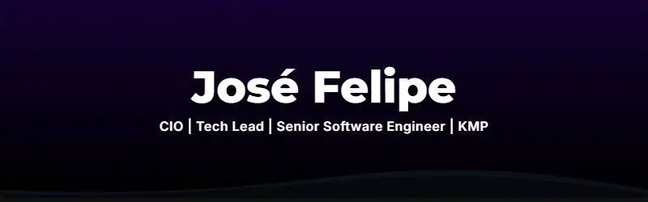

<div align="center">
  
</div>

<br/>
<div align="left">
  _+./resumo_profissional.sh" alt="Resumo Profissional" />
</div>

```ini
zespek@server:~$ cat ./resumo_profissional.ini
[ Conectando Código de Alta Performance, Cloud e Gestão Estratégica ]

[Resumo_Profissional]
  - "Engenheiro de Software Senior e Líder Técnico, atuando também como CIO."
  - "Verdadeira paixão por codar e arquitetar soluções tecnológicas complexas."
  - "Especialista em Full Stack & Mobile: do absoluto zero até o deploy em produção."

[Lideranca_Ensino]
  - "Comando times de alta performance através de metodologias ágeis."
  - "Atuo como Professor de Engenharia de Software para formar a nova geração de Devs."
```

---

<div align="left">
  _+./dominio_em_engenharia_e_deploy.sh" alt="Domínio em Engenharia" />
</div>

```ini
zespek@server:~$ cat ./detalhes_engenharia.ini
[ O coração do meu trabalho é estruturar sistemas escaláveis e orientados a performance: ]

[Frontend_Mobile]
  - "Desenvolvimento de interfaces interativas e ultrarrápidas"
  - "React, Next.js e TypeScript garantindo as melhores práticas de UI/UX"
  - "Aplicações mobile multiplataforma robustas com React Native / Expo"

[Backend_Arquitetura]
  - "Construção de lógicas de negócio complexas, seguras e eficientes"
  - "Node.js e ORMs modernos como Prisma"
  - "Bancos de dados escaláveis para suprir alto volume de requisições"

[DevOps_Cloud]
  - "Cultura de deploy contínuo e criação de pipelines de CI/CD."
  - "Orquestração de servidores, proxy reverso e conteinerização."
  - "Ecossistema Cloud: AWS, Azure, GCP, DigitalOcean, Vercel e Netlify."
```

---

<div align="left">
  _+./lideranca_tecnica_e_agil.sh" alt="Liderança Técnica" />
</div>

```ini
zespek@server:~$ cat ./lideranca_tecnica.ini
[ A tecnologia ganha poder quando alinhada a uma gestão eficiente: ]

[Gestao_Tech_Agil]

[CIO_Project_Manager:]
  - "Liderança executiva das operações, alinhando arquitetura e métricas."

[Agile_Coach_Scrum:]
  - "Implementação ágil (Scrum/Kanban) na veia dos times, quebrando silos."

[Business_Education:]
  - "MBA em Marketing Digital e Analytics (Cursando) e docência superior."

[Cybersecurity_Data:]
  - "Especializações em Modelagem Preditiva, IA e Segurança da Informação."
```

---

<div align="left">
  _+./arsenal_tecnologico.sh" alt="Arsenal Tecnológico" />
</div>

<div align="center">
  
  
  
  
  
  <br/>
  
  
  
  
  
  <br/>
  
  
  
  
  
  
  <br/>
  
  
  
  
  <br/><br/>
  
  
  
  
  
</div>

---

<div align="left">
  _+./conecte_se.sh" alt="Conecte-se" />
</div>

<div align="center">
  <a href="https://www.linkedin.com/in/josé-felipe-de-frança"></a>
  <a href="https://github.com/Zespek"></a>
  <a href="mailto:joezika2016@gmail.com"></a>
</div>

<br />
<div align="center">
  
</div>
